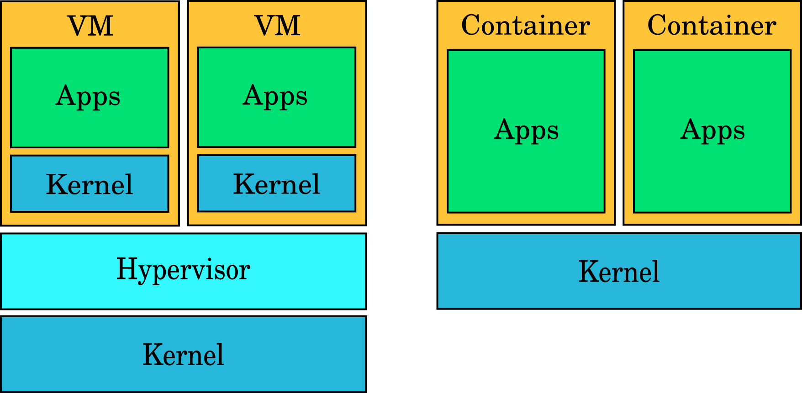

## What is Docker anyway?

To understand what Docker is, we first need to understand what a container is. In simple terms, containers solve a similar problem to virtual machines (VMs): they let you run multiple applications on one machine more efficiently.

The main difference is how they work. VMs are full operating systems installed on emulated hardware. Containers, on the other hand, share the host's kernel (the core of the operating system), which makes them far more resource efficient. It is common to run many containers in the space and resources that one VM would use.



Docker is one of the most popular container platforms, but it is not the only one. Other examples are Podman and LXC.

At a high level, Docker gives you everything in one place: build images, run containers, manage networks, and keep data with volumes. The reason people love it is simple: if it works on your machine with Docker, it will usually work the same on another machine too.

There are a few core things to understand:

- image = the blueprint (what your app needs - dependencies, variables, volumes, etc.)
- container = a running instance of that image
- Dockerfile = the recipe to build the image
- Docker Hub/registry = where images are stored and shared - like GitHub, but for Docker images

Also, Docker Compose is a big deal for real projects. It lets you start multiple services together (for example app + database + Redis) with one command, which makes local development and testing much easier.

## Let's install Docker

Pick your OS below. Only one setup is shown at a time.

<div class="docker-tabs">
  <input type="radio" id="docker-os-windows" name="docker-os" checked />
  <input type="radio" id="docker-os-linux" name="docker-os" />
  <input type="radio" id="docker-os-macos" name="docker-os" />

  <div class="docker-tabs-switch" role="tablist" aria-label="Docker install operating system selector">
    <label for="docker-os-windows">Windows</label>
    <label for="docker-os-linux">Linux</label>
    <label for="docker-os-macos">macOS</label>
  </div>

  <section class="docker-tab-panel docker-panel-windows">
    <h3>Windows</h3>
    <p>On Windows, it is recommended to run Docker with WSL (Windows Subsystem for Linux). This runs the Linux kernel on top of Windows, allowing Docker to work natively.</p>
    <p>Check if WSL is already installed. Open Terminal or PowerShell as Administrator and run:</p>
    <pre><code>wsl --status
wsl -l -v</code></pre>
    <p><em>Expected output:</em></p>
    <div class="expected-output"><em>Default Distribution: Ubuntu<br />Default Version: 2<br />NAME STATE VERSION<br />Ubuntu Running 2</em></div>
    <p>If WSL is missing, install it (then restart your PC):</p>
    <pre><code>wsl --install
wsl --set-default-version 2</code></pre>
    <p><em>Expected output:</em></p>
    <div class="expected-output"><em>Installing: Windows Subsystem for Linux<br />Installing: Ubuntu<br />The requested operation is successful. Restart is required.</em></div>
    <p>Install Docker Desktop with Winget:</p>
    <pre><code>winget install -e --id Docker.DockerDesktop</code></pre>
    <p><em>Expected output:</em></p>
    <div class="expected-output"><em>Found Docker Desktop<br />Downloading...<br />Successfully installed</em></div>
    <p>Open Docker Desktop once, wait for it to start, then verify:</p>
    <pre><code>docker --version
docker run hello-world</code></pre>
    <p><em>Expected output:</em></p>
    <div class="expected-output"><em>Docker version 27.x.x, build xxxxxxx<br />Unable to find image 'hello-world:latest' locally<br />Hello from Docker!</em></div>
  </section>

  <section class="docker-tab-panel docker-panel-linux">
    <h3>Linux (major distros)</h3>
    <p>First, check your distro and whether Docker is already installed:</p>
    <pre><code>cat /etc/os-release
  docker --version</code></pre>
    <p><em>Expected output:</em></p>
    <div class="expected-output"><em>NAME="Ubuntu" or NAME="Fedora" or NAME="Arch Linux"<br />Docker version 27.x.x, build xxxxxxx (if already installed)</em></div>
    <p>If Docker is missing, use the commands for your distro:</p>
    <p>Ubuntu/Debian:</p>
    <pre><code>sudo apt-get update
sudo apt-get install -y ca-certificates curl gnupg docker.io docker-compose-v2
sudo systemctl enable --now docker</code></pre>
    <p><em>Expected output:</em></p>
    <div class="expected-output"><em>Reading package lists... Done<br />Setting up docker.io ...<br />docker.service enabled</em></div>
    <p>Fedora / RHEL / Rocky / AlmaLinux:</p>
    <pre><code>sudo dnf install -y docker docker-compose-plugin
sudo systemctl enable --now docker</code></pre>
    <p><em>Expected output:</em></p>
    <div class="expected-output"><em>Installed: docker ...<br />Installed: docker-compose-plugin ...<br />Created symlink for docker.service</em></div>
    <p>Arch Linux:</p>
    <pre><code>sudo pacman -Syu --noconfirm docker docker-compose
sudo systemctl enable --now docker</code></pre>
    <p><em>Expected output:</em></p>
    <div class="expected-output"><em>resolving dependencies...<br />installing docker...<br />Created symlink for docker.service</em></div>
    <p>Optional: run Docker without sudo:</p>
    <pre><code>sudo usermod -aG docker $USER
newgrp docker</code></pre>
    <p><em>Expected output:</em></p>
    <div class="expected-output"><em>No output is usually returned.<br />Current shell refreshes docker group membership.</em></div>
    <p>Verify installation:</p>
    <pre><code>docker --version
docker run hello-world</code></pre>
    <p><em>Expected output:</em></p>
    <div class="expected-output"><em>Docker version 27.x.x, build xxxxxxx<br />Hello from Docker!</em></div>
  </section>

  <section class="docker-tab-panel docker-panel-macos">
    <h3>macOS</h3>
    <p>Check if Homebrew and Docker are already installed:</p>
    <pre><code>brew --version
docker --version</code></pre>
    <p><em>Expected output:</em></p>
    <div class="expected-output"><em>Homebrew 4.x.x (if Homebrew is installed)<br />Docker version 27.x.x, build xxxxxxx (if Docker is installed)</em></div>
    <p>If Homebrew is missing, install it first:</p>
    <pre><code>/bin/bash -c "$(curl -fsSL https://raw.githubusercontent.com/Homebrew/install/HEAD/install.sh)"</code></pre>
    <p><em>Expected output:</em></p>
    <div class="expected-output"><em>Installation successful!<br />Homebrew is now installed.</em></div>
    <p>Install Docker Desktop with Homebrew:</p>
    <pre><code>brew install --cask docker</code></pre>
    <p><em>Expected output:</em></p>
    <div class="expected-output"><em>Downloading Docker Desktop<br />Installing cask docker<br />docker was successfully installed</em></div>
    <p>Open Docker Desktop once, then verify:</p>
    <pre><code>docker --version
docker run hello-world</code></pre>
    <p><em>Expected output:</em></p>
    <div class="expected-output"><em>Docker version 27.x.x, build xxxxxxx<br />Hello from Docker!</em></div>
  </section>
</div>


## For new users

At the beginning, this can feel like a lot, and you might not always know what you are doing. That is okay.

Some hard won advice:

- Start with the UI in the beginning. Yes, terminal-only setups look cool, but small steps win. For me, Docker Desktop made it much easier to understand what was happening. On Linux, Portainer CE was also very helpful.
- Repeat UI actions in the terminal. Example: in the UI you click a container and open logs; in terminal you use commands. In real environments you will not always have a UI, so this is worth practicing.
- Use search and AI, but understand every command before you run it. Do not blindly copy and paste.
- Have fun. Deploy stuff, break it, misconfigure it, then fix it. That is normal learning.

## Wrap-up

You made it. At this point, you are not just reading about Docker, you are driving it.

In this post we covered:

1. What containers are and how they differ from VMs.
2. Why Docker is useful for both local development and production-style workflows.
3. How to install and verify Docker on Windows, Linux, and macOS.

Now for the fun part: training containers you can run in minutes.

### 1) Hello web server (Nginx)

```bash
docker run -d --name training-nginx -p 8080:80 nginx
```

Expected result: open `http://localhost:8080` and you should see the Nginx welcome page.

### 2) Tiny container that shows request info (Traefik Whoami)

```bash
docker run -d --name whoami -p 8081:80 traefik/whoami
```

Expected result: open `http://localhost:8081` and you will see request headers and container details.

### 3) Portainer (easy Docker UI)

```bash
docker volume create portainer_data
docker run -d --name portainer -p 9000:9000 -p 9443:9443 --restart=always -v /var/run/docker.sock:/var/run/docker.sock -v portainer_data:/data portainer/portainer-ce:latest
```

Expected result: open `https://localhost:9443` and complete the first-time setup.

### 4) Dozzle (live Docker logs in browser)

```bash
docker run -d --name dozzle -p 9999:8080 -v /var/run/docker.sock:/var/run/docker.sock amir20/dozzle:latest
```

Expected result: open `http://localhost:9999` and watch container logs live.

### 5) Minecraft server (pure fun lab)

```bash
docker run -d --name mc-server -e EULA=TRUE -p 25565:25565 itzg/minecraft-server
```

Expected result: your Minecraft client can connect to `localhost:25565`.

If you want to keep leveling up, here is a simple challenge path:

1. Run one container.
2. Stop it, remove it, and run it again with a volume.
3. Convert the same setup into a `docker-compose.yml` file.
4. Break it on purpose, then fix it.

That is how real Docker confidence is built: run, break, fix, repeat.
